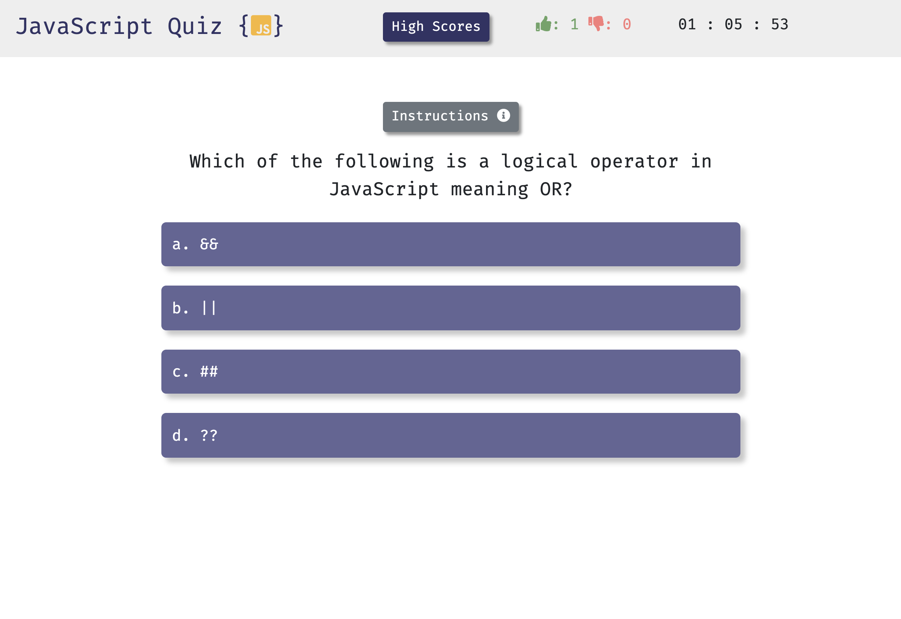

# JavaScript Quiz

## Deployed Application 

[JavaScript Quiz](https://mhans003.github.io/codequiz/)

## Description 

This program is a timed JavaScript quiz game that stores high scores in the browser's local storage. 

The game initiates when the player presses the start button. The player has 90 seconds to answer as many JavaScript-related questions correctly as possible. Answering incorrectly results in a loss of time. When the game is over, the user has the option to store a name and the high score in the game's high scores list. 

The program ensures that the questions are shuffled upon each iteration of gameplay. 

## Features

* Responsive to screen sizes across devices. 
* Incorporates Bootstrap utilities including container, modal, buttons, and navbar. 
* Demonstrates the use of the browser's local storage utilizing the localStorage and JSON objects. 
* Font Awesome icons support a more satisfying layout. 
* Sounds and CSS animations produce a more engaging gameplay experience. 
* Timer displays remaining time down to the hundredth second. 
* Dynamically-produced elements allow for a cleaner HTML homepage. 
* JavaScript, HTML, CSS

## Contact

Michael Hanson
* michaeledwardhanson@gmail.com
* [GitHub](https://github.com/mhans003)
* [LinkedIn](https://www.linkedin.com/in/michaeledwardhanson/)

## License 

Licensed under the [MIT License](./LICENSE.txt).

